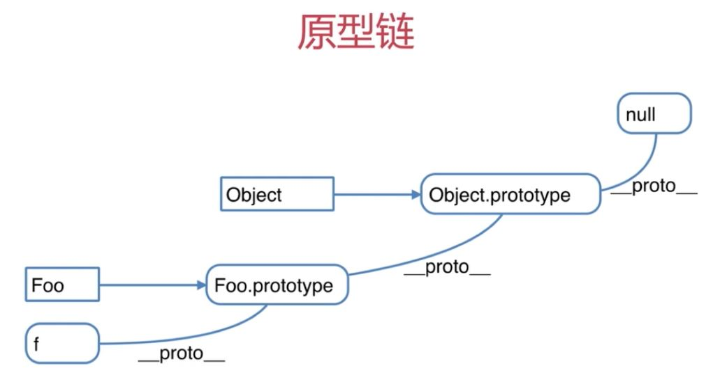

## 变量题目
1. JS中使用typeof能得到哪些类型
```js
typeof undefined; //undefined
typeof 'abc'; //string
typeof 123; //number
typeof true; //boolean
//以上四点可以看出,typeof只能区分值类型的详细类型
typeof {}; //object
typeof []; //object
typeof null; //object
typeof console.log; //function
```
2. 何时使用 === 和 ==
```js
if(obj.a == null){
    //这里相当于obj.a === null || obj.a === undefined的简写形式
    // 这是jqurey源码中推荐的写法
}
```
3. JS中有哪些内置函数
```js
Object
Array
Boolean
Number
String
Function
Date
RegExp
Error
```
4. JS变量按照**储存方式**区分为哪些类型，并描述其特点
- 变量类型
1. 值类型
```js
var a = 100;
var b = a;
a = 200;
console.log(b); //100
```
2. 引用类型
```js
var a = {age:20};
var b = a;
b.age = 21;
console.log(a.age); //21
```
5. 如何理解JSON
```js
//JSON只不过是一个JS对象
JSON.stringify({a:10,b:20});
JSON.parse('{"a":10,"b":20}');
```
--------------------------
## 变量计算 - 强制类型转换
1. 字符串拼接
```js
var a = 100 + 10; //110
var b = 100 + '10'; //'10010'
```
2. ==运算符
```js
100 == '100'; //true
0 == ''; //true
null ==undefined; //true
```
3. if语句
```js
var a = true;
if(a){
    //...
}
var b = 100;
if(b){
    //...
}
var c = '';
if(c){
    //...
}
```
4. 逻辑运算符
```js
console.log(10 && 0); //0
console.log('' || 'abc'); //'abc'
console.log(!window.abc); //true
//判断一个变量会被当做true还是false
var a = 100;
console.log(!!a); //true
```
---------------------------------
## 原型链题目
1. 如何准确判断一个变量是数组类型
```js
var arr = [];
arr instanceof Array; //true
typedof arr //object  , typeof无法判断是否是数组
```
2. 写一个原型链继承的例子
```js
//动物
function Animal(){
    this.eat = function(){
        console.log('animal eat');
    }
}
//狗
function Dog(){
    this.bark = function(){
        console.log('dog bark');
    }
}
Dog.prototype = new Animal();
//哈士奇
var hashiqi = new Dog();
```
```js
function Elem(id){
    this.elem = document.getElementById(id);
}

Elem.prototype.html = function(val){
    var elem = this.elem;
    if(val){
        elem.innerHTML = val;
        return this; //return后可以执行链式操作
    }else{
        return elem.innerHTML;
    }
}

Elem.prototype.on = function(type,fn){
    var elem = this.elem;
    elem.addEventListener(type,fn);
    return this;
}

var div1 = new Elem('id');
//console.log(div1.html());
div1.html('<p>hello zhupan</p>').on('click',function(){
    alert('clicked');
}).html('<p>javascript</p>')
```
3. 描述new一个对象的过程
```js
//创建一个新对象
//this指向这个新对象 
//执行代码,即对this复制
//返回this
function Foo(name,age){
    this.name = name;
    this.age = age;
    this.class = 'class - 1';
    //return this; //默认有这一行
}
var f = new Foo('zhangsan',20);
//var f1 = new Foo('lisi',22); //创建多个对象
```
4. zepto(或其他框架)源码中如何使用原型链
- 阅读源码是高效提高技能的方式,但不能"埋头苦钻"有技巧在其中,慕课网搜索"zepto设计和源码分析"
```js
```
 ---
## 知识点
1. 构造函数
```js
function Foo(name,age){
    this.name = name;
    this.age = age;
    this.class = 'class - 1';
    //return this; //默认有这一行
}
var f = new Foo('zhangsan',20);
//var f1 = new F00('lisi',22); //创建多个对象
```
2. 构造函数-扩展
```js
var a = {}; //其实是var a = new Object();的语法糖
var a = []; //其实是Var a = new Array();的语法糖
function Foo(){...}; //其实是var Foo = new Funtion(...)
//使用istanceof判断一个函数是否是一个变量的构造函数 
```

3. 原型规则和示例  
```js
//1.所有的引用类型(数组、对象、函数),都具有对象特性,即可自由扩展属性(除了"null"以外)
var obj = {};
obj.a = 100;
var arr = [];
arr.b = 100;
function fn() {};
fn.a = 100;
//2.所有的引用类型(数组、对象、函数),都有一个隐式原型__proto__属性,属性值是一个普通的对象
console.log(obj.__proto__);
console.log(arr.__proto__);
console.log(fn.__proto__);
//3.所有的引用类型(数组、对象、函数),其隐式原型__proto__属性值指向它的构造函数的显式原型prototype属性值
console.log(obj.__proto__ === Object.prototype)
//4.所有的函数,都有一个显式原型prototype属性,属性值也是一个普通的对象
console.log(fn.prototype);
//5.当试图得到一个对象的某个属性时,但这个对象本身没有这个属性,那么会去它的__proto__(即它的构造函数的prototype)中寻找
function Foo(name,age){
    this.name = name;
}
Foo.prototype.alertName = function(){
    alert(this.name);
}
//创建示例
var f = new Foo('zhangsan');
f.printName = function(){
    console.log(this.name);
} 
//测试
f.printName();
f.alertName();
f.toString(); //要去f.__proto__.proto__中查找
```
4. 原型链  

5. instacce of
- 用于判断引用类型属于哪个构造函数的方法
- f instance Foo的判断逻辑是：f的__proto__一层一层往上,能否对应到Foo.prototype,再试着判断f instanceof Object
---
## 作用域和闭包题目
1. 说一下对变量提升的理解
- 变量定义
- 函数声明(注意和函数表达式的区别)
2. 说明this几种不同的使用场景
3. 创建10个`<a>`标签，点击的时候弹出对应的序号
```js
var i;
for(i = 0;i < 10;i++){
    (function(i){
        var a = document.createElement('a');
        a.innerHTML = i + '<br>';
        a.addEventListener('click',function(e){
            e.preventDefault();
            alert(i); // 自由变量，要去父作用域获取值
        })
        document.body.appendChild(a);
    })(i)
}
```
4. 如何理解作用域
- 自由变量
- 作用域链,即自由变量的查找
- 闭包的两个场景
5. 实际开发中闭包的应用
```js
//闭包实际应用中主要用于封装变量，收敛权限
function isFirstLoad(){
    var _list = [];
    return function(id){
        if(_list.indexOf(id) >= 0){
            return false;
        }else {
            _list.push(id);
            return true;
        }
    }
}
//使用
var firstLoad = isFirstLoad();
firstLoad(10); //true
firstLoad(10); //false
firstLoad(20); //true
firstLoad(20); //false
//你在isFirstLoad函数外面，不可能修改_list的值
```
---
## 知识点
1. 执行上下文
- 范围:一段`<script>`或者一个函数
- 全局:变量定义、函数声明  一段`<script>`
- 函数:变量定义、函数声明、this、arguments   函数
- PS:注意"函数声明"和"函数表达式"的区别
```js
console.log(a); //undefined
//下一行为函数表达式
var a = 100;

fn('zhangsan'); //'zhangsan' 20
//以下为函数声明
function fn(name){
    age = 20;
    console.log(name,age);
    var age;
}
```
2. this
- this要在执行时才能确认值,定义时无法确认
```js
var a = {
    name:'A',
    fn:function(){
        console.log(this.name);
    }
}
//上面是定义时,下一行为执行时
a.fn(); //this === a
a.fn.call({name:'B'}); //this ==={name:'B'}
var fn1 = a.fn;
fn1(); //this === window
```
- 作为构造函数执行
```js
function Foo(name){
    this.name = name;
}
var f = new Foo('zhangsan');
```
- 作为对象属性执行
```js
var obj = {
    name = 'A',
    printName: function(){
        console.log(this.name);
    }
}
obj.printName();
```
- 作为普通函数执行
```js
function fn(){
    console.log(this); //this === window
}
fn();
```
- call apply bind  
说明(call ()和apply()作用一样，但是call()可以接收任何类型的参数，而apply()只能接收数组参数。)
```js
//call
function fn1(name,age){
    alert(name);
    console.log(this);//this为{x:100}
}
fn1.call({x:100},'zhangsan',20);
//apply
function fn2(name,age){
    alert(name);
    console.log(this);//this为{x:100}
}
fn2.apply({x:100},['zhangsan',20]);
//bind
var fn3 = function (name,age){
    alert(name);
    console.log(this); //this为{y:200}
}.bind({y:200})
fn3('zhangsan',20);
```

3. 作用域
- 没有块级作用域
```js
if(true){
    var name = 'zhangsan';
}
console.log(name);
```
- 只有函数和全局作用域
```js
var a = 100;
function fn(){
    var a = 200;
    console.log('fn',a);
}
console.log('global',a);
fn();
```
4. 作用域链
```js
var a = 100;
function fn(){
    var b = 200;
    //当前作用域没有定义的变量,即"自由变量"
    console.log(a);
    console.log(b);
}
fn();
```
```js
var a = 100;
function F1(){
    var b = 200;
    function F2(){
        var c = 300;
        console.log(a); //a是自由变量
        console.log(b); //b是自由变量
        console.log(c);
    }
    F2();
}
F1();
```
5. 闭包
- 函数作为返回值 
```js
function F1(){
    var a = 100;
    //返回一个函数(函数作为返回值)
    return function(){
        console.log(a);
    }
} 
//f1得到一个函数
var f1 = F1();
var a = 200;
f1(); //100
```  
- 函数作为参数传递
```js
function F1(){
    var a = 100;
    //返回一个函数(函数作为返回值)
    return function(){
        console.log(a); //自由变量,父作用域寻找
    }
} 
//f1得到一个函数
var f1 = F1();

function F2(fn){
    var a = 200;
    fn();
}
F2(f1); //100,a的值跟执行作用域无关，与声明作用域有关
```
---
## 异步和同步题目
1. 同步和异步的区别是什么？分别举一个同步和异步的例子
- 同步会阻塞代码执行,而异步不会
- alert是同步,setTimeout是异步

2. 一个关于setTimeout的笔试题
```js
console.log(1);
setTimeout(function(){
    console.log(2);
},0)
console.log(3);
setTimeout(function(){
    console.log(4);
},1000)
console.log(5);
```
3. 前端使用异步的场景有哪些
- 定时任务:setTimeout,setInverval
- 网络请求:ajax请求,动态加载
```js
//ajax请求
console.log('start');
$.get('./data1.json',function(data1){
    console.log(data1);
})
console.log('end');
  
//动态加载
console.log('start');
var img = document.createElement('img');
img.onload = function(){
    console.log('loaded');
}
img.src = '/xxx.png';
console.log('end');
```
- 事件绑定
```js
console.log('start');
document.getElementById('btn1').addEventListener('click',function(){
    console.log('clicked');
})
console.log('end');
```
4. 异步和单线程
- 执行第一行,打印100
- 执行setTimeout后,传入setTimeout的函数会被暂存起来,不会立即执行(单线程的特点,不能同时干两件事)
- 执行最后一行,打印300
- 待所有程序执行完,处于空闲状态时,会立马看有没有暂存起来的要执行
- 发现暂存起来的setTimeout中的函数无需等待时间,就立即来过来执行 
```js
console.log(100);
setTimeout(function(){
    console.log(200);
});
console.log(300);
```
---

## 知识点
1. 什么是异步(对比同步)
```js
console.log(100);
setTimeout(function(){
    console.log(200);
},1000);
console.log(300);

//对比同步
console.log(100);
alert(200); //1秒钟之后点击确认 
console.log(300);
```
2. 何时需要异步?
- 在可能发生等待的情况下
- 等待过程中不能像alert一样阻塞程序运行
- 因此,所有的"等待的情况"都需要异步
---

## 其他JS题目
1. 获取2017-06-10格式的日期
```js
function formatDate(dt){
    if(!dt){
        dt = new Date();
    }
    var year = dt.getFullYear();
    var month = dt.getMonth() + 1;
    var date = dt.getDate();
    if(month < 10){
        //强制类型转换
        month = '0' + month;
    }
    if(date < 10){
        //强制类型转换
        date = '0' + date;
    }
    //强制类型转换
    return year + '-' + month + '-' +date;
}
var dt = new Date();
var formatDate = formatDate(dt);
console.log(formatDate);
```
2. 获取随机数,要求是长度一致的字符串格式
```js
var random = Math.random();
var random = random + '0000000000';
var random = random.slice(0,10);
console.log(random);
```
3. 写一个能遍历对象和数组的通用forEach函数
```js
function forEach(obj,fn){
    var key;
    if(obj instanceof Array){
        //准确判断是不是数组
        obj.forEach(function(item,index){
            fn(index,item);
        })
    }else{
        //不是数组就是对象
        for(key in obj){
            if(obj.hasOwnProperty(key)){
                fn(key,obj[key]);
            }
        }
    }
}

var arr = [1,2,3];
forEach(arr,function(index,item){
    //注意,这里参数的顺序换了,为了和对象的遍历格式一致
    console.log(index,item);
}) 
var obj = {
    x:100,
    y:200
}
forEach(obj,function(key,val){
    console.log(key,val);
})
```

---
## 知识点
1. 日期
```js
Date.now(); //获取当前时间毫秒数
var dt = new Date();
dt.getTime(); //获取毫秒数
dt.getFullYear(); //年
dt.getMonth(); //月(0-11), 得到的数需要+1
dt.getDate(); //日(1-31)
dt.getHours(); //小时(0-23)
dt.getMinutes(); //分钟(0-59)
dt.getSeconds(); //秒(0-59)
```
2. Math
```js
Math.random(); //获取随机数
```
3. 数组API
- forEach遍历所有元素
```js
var arr = [1,2,3];
arr.forEach(function(item,index){
    //遍历数组的所有元素
    console.log(index,item);
})
```
- every判断所有元素是否都符合条件
```js
var arr = [1,2,3];
var result = arr.every(function(item,index){
    //用来判断所有的数组元素,都满足一个条件
    if(item < 4){
        return true;
    }
})
console.log(result);
```
- some判断是否有至少一个元素符合条件
```js
var arr = [1,2,3];
var result = arr.some(function(item,index){
    //用来判断所有的数组元素,只要有一个满足条件即可
    if(item < 2){
        return true;
    }
})
console.log(result);
```
- sort排序
```js
var arr = [1,4,2,3,5];
var result = arr.sort(function(a,b){
    //从小到大排序
    return a - b;
    //从大到小排序
    //return b - a;
})
console.log(result);
```
- map对元素重新组装,生成新数组
```js
var arr = [1,2,3,4];
var result = arr.map(function(item,index){
    //将元素重新组装,并返回
    return '<b>' + item + '</b>';
})
console.log(result);
```
- filter过滤符合条件的元素
```js
var arr = [1,2,3];
var result = arr.filter(function(item,index){
    //通过某一个条件过滤数组
    if(item >= 2){
        return true;
    }
})
console.log(result);
```
4. 对象API
```js
var obj = {
    x:100,
    y:200,
    z:300
}
var key;
for(key in obj){
    if(obj.hasOwnProperty(key)){
        console.log(key,obj[key]);
    }
}
```
---
## JSWebAPI
- 常说的JS(浏览器执行的JS)包含两部分
- JS基础知识(ECMA262标准)
- JS-Web-API(W3C标准)


 